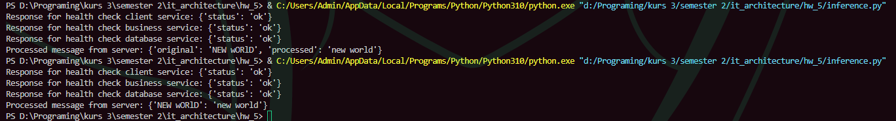
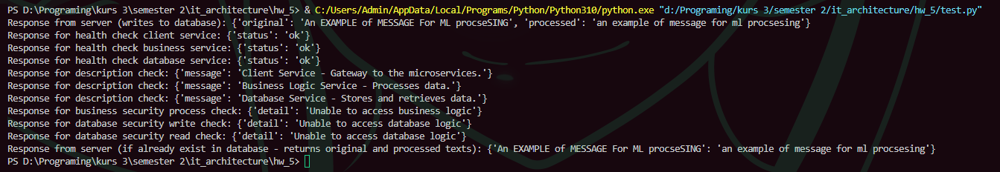

# Microservice architecture
This project desings service microsystem that work together to provide a seamless flow of client requests. The services include the **Client Service**, **Database Service**, and **Business Logic Service**

## Services Overview

### 1. **Client Service**
The Client Service handles incoming requests from clients and interacts with the other services to process and respond to those requests
- http://localhost:8000/

### 2. **Business Logic Service**
The Business Logic Service processes the data (message) to lowercase as an example of some ML operation
- http://localhost:8001/

### 3. **Database Service**
The Database Service is responsible for interacting with the database, handling data storage and retrieval
- http://localhost:8002/

### Prerequisites
Make sure you have the following software installed:
- Python 3.x
- Docker

## Setup and Running the Services
So start all services, copy the directory from github repository and in that directory run
```bash 
docker compose up
```
and run
```bash 
pip install requirements.txt
```

http://localhost:8000/invoke is the main client service side, where client sends text for processing. He can not directly call methods from 8001 and 8002 ports, this is handled with token-based mechanism in code <br>
**Client → (Client Service) → Database Service → Business Logic Service → Database Service → Client:**
1. Clients sends message through invoke
2. Database checks if already processed message exists
3. If not exist it is processing message using business service, saves into database, where key is original text and value is processed text. If message already exist, database returns saved processed result with original text.

# Results
After you set up the project, navigate into **inference.py** file, change variable *text_to_process* to desire message (text) in str format and run file. Output will be original and processed texts <br>
Also you can run **test.py** file to check everything works fine <br>
For user interacting and testing library *requests* was used
This is an example of what user will get after runing client service in **inference.py** file


# Homework 6
## Part 1
- Run podman build to create an image of your application.
```bash 
podman build client_service
docker build client_service
```

- Use podman run to run the application container with your image.
```bash 
podman run -d --name client_logic -p 8000:8000 client_service
docker run -d --name client_logic -p 8000:8000 client_service
```

- Make a test request to your service.
This is an example of testing endpoints from **test.py** file.


- Check service logs.
After runnigs **test.py** file the following logs present from containers
Database container
```bash
2025-04-16 13:47:02 INFO:     Started server process [1]
2025-04-16 13:47:02 INFO:     Waiting for application startup.
2025-04-16 13:47:02 INFO:     Application startup complete.
2025-04-16 13:47:02 INFO:     Uvicorn running on http://0.0.0.0:8002 (Press CTRL+C to quit)
2025-04-16 13:48:37 INFO:     172.18.0.4:47610 - "GET /read?original_text=An+EXAMPLE+of+MESSAGE+For+ML+procseSING HTTP/1.1" 200 OK
2025-04-16 13:48:37 INFO:     172.18.0.4:47618 - "POST /write HTTP/1.1" 200 OK
2025-04-16 13:48:37 INFO:     172.18.0.1:38672 - "GET /health HTTP/1.1" 200 OK
2025-04-16 13:48:37 INFO:     172.18.0.1:38684 - "GET / HTTP/1.1" 200 OK
2025-04-16 13:48:37 INFO:     172.18.0.1:38696 - "POST /write HTTP/1.1" 403 Forbidden
2025-04-16 13:48:37 INFO:     172.18.0.1:38704 - "GET /read?original_text=%7Boriginal_text%7D HTTP/1.1" 403 Forbidden
2025-04-16 13:48:37 INFO:     172.18.0.4:47632 - "GET /read?original_text=An+EXAMPLE+of+MESSAGE+For+ML+procseSING HTTP/1.1" 200 OK
```
Business container
```bash
2025-04-16 13:47:02 INFO:     Started server process [1]
2025-04-16 13:47:02 INFO:     Waiting for application startup.
2025-04-16 13:47:02 INFO:     Application startup complete.
2025-04-16 13:47:02 INFO:     Uvicorn running on http://0.0.0.0:8001 (Press CTRL+C to quit)
2025-04-16 13:48:37 INFO:     172.18.0.4:57074 - "POST /process HTTP/1.1" 200 OK
2025-04-16 13:48:37 INFO:     172.18.0.1:42034 - "GET /health HTTP/1.1" 200 OK
2025-04-16 13:48:37 INFO:     172.18.0.1:42038 - "GET / HTTP/1.1" 200 OK
2025-04-16 13:48:37 INFO:     172.18.0.1:42054 - "POST /process HTTP/1.1" 403 Forbidden
```
Client service container
```bash
2025-04-16 13:47:02 INFO:     Started server process [1]
2025-04-16 13:47:02 INFO:     Waiting for application startup.
2025-04-16 13:47:02 INFO:     Application startup complete.
2025-04-16 13:47:02 INFO:     Uvicorn running on http://0.0.0.0:8000 (Press CTRL+C to quit)
2025-04-16 13:48:37 INFO:     172.18.0.1:54700 - "POST /invoke?original_text=An+EXAMPLE+of+MESSAGE+For+ML+procseSING HTTP/1.1" 200 OK
2025-04-16 13:48:37 INFO:     172.18.0.1:54708 - "GET /health HTTP/1.1" 200 OK
2025-04-16 13:48:37 INFO:     172.18.0.1:54720 - "GET / HTTP/1.1" 200 OK
2025-04-16 13:48:37 INFO:     172.18.0.1:54730 - "POST /invoke?original_text=An+EXAMPLE+of+MESSAGE+For+ML+procseSING HTTP/1.1" 200 OK
```
- Clean working environment.
```bash
docker compose down
podman compose down
```
## Part 2
1. Create a second fastAPI application. Make sure it has the URL to the first service stored securely.
2. The logic of the second application should be plain simple: it should call the first one on a scheduled basis, let’s say every 10 seconds.
3. Create a compose file that describes both of your applications.
All is present in **scheduler_logic** with **scheduler_service.py** folder and  **docker-compose.yaml** main folder.
- Run podman compose in the directory with compose file and according services.

```bash
docker compose up
podman-compose up --build -d
```

- Verify both containers started.
```bash
docker ps
podman ps
```
# Notes
For more information, you can check each file, where is stored all endpoints and code.
